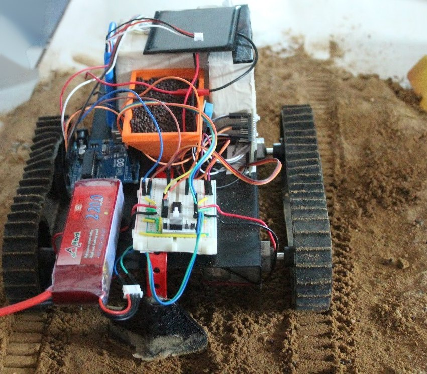
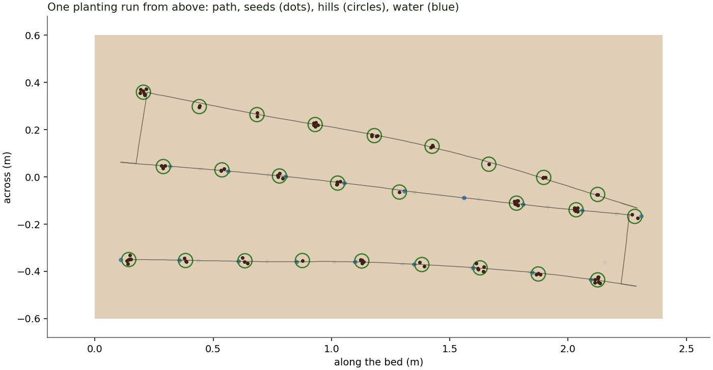
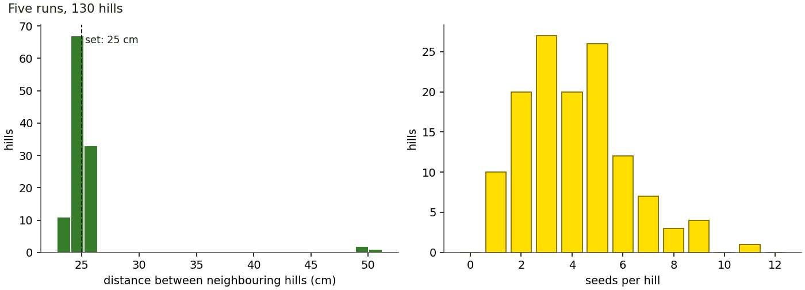

# FARM-E Plantation Lab

FARM-E is a small tracked plantation robot. It drives a bed in serpentine rows, stops at a set spacing, drops a pinch of seed, waters it and moves on, while a phone on its Wi-Fi watches and steers. This repository holds its firmware for both boards, a co-simulator that runs that firmware on a virtual robot, a generated 3D model, and an interactive site that explains the whole machine.

**Live site:** https://sundarrajnitish.github.io/FARM-E-Plantation-Lab/



## The machine

A steel deck on rubber tracks carries an orange 3D-printed seed hopper with a servo flap, a water tank and pump, and an HC-SR04 ultrasonic sensor looking down at the soil just ahead of the tracks.

- **Arduino UNO** ([`firmware/FarmeDrive`](firmware/FarmeDrive/)): tracks, seed flap, pump, sonar, battery sense.
- **NodeMCU / ESP8266** ([`firmware/FarmeLink`](firmware/FarmeLink/)): Wi-Fi access point, the phone page and JSON API, the DHT11, and reliable delivery of commands to the UNO.

| Pin | Part |
|---|---|
| D2, D4 / D6, D7 | left / right track (H-bridge IN1-IN4; both HIGH brakes) |
| D9 | SG90 on the hopper flap |
| D12 | pump |
| A4 / A5 | HC-SR04 trigger / echo |
| A3 | battery through 10 k&Omega; / 3.3 k&Omega; |
| A0 / A1 | software UART to the NodeMCU's D6 / D5 (1 k&Omega; / 2 k&Omega; divider on the UNO's TX) |
| NodeMCU D2 | DHT11 |

## How it plants

The UNO runs a non-blocking state machine ([`src/drive_core.*`](firmware/FarmeDrive/src/)):

1. **Calibrate.** Standing still, seven pings that agree within 15 mm set the ground distance.
2. **Settle, seed, water.** Brake, open the flap to 40&deg; for 80 ms plus the set seed time, then pump a measured dose (20 mL by default).
3. **Drive** the set spacing (25 cm by default). Distance is time at a battery-compensated ground speed, counted once the tracks are up to speed.
4. **Edge.** While moving, the sonar is read every 30 ms. Two readings more than 40 mm below the learned ground, three missing echoes in a row, or no ping for 150 ms mean "no ground ahead": the tracks brake at once. The robot backs off 8 cm, turns 90&deg;, shifts one row gap, turns again and plants the next row. After the last row it reports DONE.

Manual driving from the phone uses the same edge guard. Each drive command carries a hold time, so if the phone goes quiet the robot stops within half a second. A low battery pauses the run; the firmware tracks the tank and flags when it runs low. Settings live in EEPROM with a CRC, and a 1 s watchdog guards the loop.

### The link between the boards

19200 baud, one text line per frame, checked with CRC-8 ([`farme_proto.h`](firmware/FarmeDrive/src/farme_proto.h)):

```
$C,17,4,3,450*C4     NodeMCU -> UNO   command: seq 17, drive (4), left (3), 450 ms
$H,280,62*..         NodeMCU -> UNO   heartbeat: 28.0 C, 62 %RH (speed of sound)
$T,17,3,2,24,55,...  UNO -> NodeMCU   telemetry: ack, state, mode, flags, ground, hills, row, tank, battery, fault
```

One command is in flight at a time. The UNO echoes its sequence number in a telemetry line about 20 ms later; without that echo, the NodeMCU resends after 150 ms. A repeat the UNO has already seen is acknowledged but not acted on twice. STOP jumps the queue.

### The phone

Join the *FARM-E* network and open `http://192.168.4.1`. The page ([`ui/index.html`](firmware/FarmeLink/ui/index.html), embedded by `tools/embed_ui.py`) shows state, hills, row, tank, ground distance, battery and air, and has hold-to-drive arrows, Plant / Pause / Manual / STOP, Seed, Water, and the planting settings.

| Request | Does |
|---|---|
| `/api/status` | JSON: link, mode, state, flags, fault, ground, hills, row, tank, battery, air |
| `/api/cmd?c=auto` / `pause` / `stop` / `manual` / `clear` | start, pause, stop a run; manual mode; clear a fault |
| `/api/cmd?c=drive&d=F&ms=450` | drive F, B, L or R for up to 1 s |
| `/api/cmd?c=seed`, `water&ms=1500`, `refill` | one hill of seed; a timed squirt; tank refilled |
| `/api/cmd?c=set&p=spacing&v=250` | `spacing`, `rows`, `rowgap`, `water`, `seedms`, `speed`, `turn`, `edge`, `tank`, `pump` |

## Results

From `python -m farmelab`: five full runs on a 2.4 &times; 1.2 m table-top bed with default settings, plus targeted tests ([`results/findings.json`](results/findings.json)).

| | |
|---|---|
| Hills per run | 26, in three serpentine rows (70 s, 7.2 m driven) |
| Hill spacing (set 25 cm) | 25.6 cm &plusmn; 2.9 cm |
| Seeds per hill | 4.1, in a 2.4 cm cluster |
| Water within 5 cm of a hill | 94 % |
| Sonar past the edge when it stops | 2.0 cm (75 cm drop), 1.9 cm (12 cm bed), 1.9 cm (6 cm step) |
| Echo wire open | sonar fault, robot does not move |
| Spacing on a full / tired battery | 25.2 / 24.8 cm |
| STOP from the phone | tracks stopped 27 ms after the tap |
| Phone leaves mid-drive | robot stops within 7.6 cm |
| Commands lost over five runs | 0 |
| Longest UNO loop / phone page served | 17.4 ms / 8 ms |





With no gyro or wheel encoders, heading drifts a few degrees per row; the sonar watching the sides of the bed keeps the robot on it.

## Flashing

1. **UNO:** open `firmware/FarmeDrive` in the Arduino IDE, board *Arduino UNO* (Servo, SoftwareSerial and EEPROM are built in). 15.4 KB flash, 0.9 KB RAM.
2. **NodeMCU:** install the ESP8266 core and the *DHTStable* library (Rob Tillaart). Copy `secrets.example.h` to `secrets.h` and set a password (8-63 characters). Open `firmware/FarmeLink`, board *NodeMCU 1.0 (ESP-12E)*.
3. Wire as in the pin table, power up, join *FARM-E*, open `http://192.168.4.1`.

Both sketches compile cleanly (avr-gcc 7.3 for the ATmega328P, ESP8266 core 3.1.2); CI builds them on every push.

## The simulator

[`sim/`](sim/) is C++: mock Arduino AVR and ESP8266 cores (pins, `delay`, `pulseIn`, `Stream`, `SoftwareSerial` with byte timing and half-duplex losses, `Servo`, EEPROM, watchdog, the ESP8266 web server and soft AP, DHT11), a physical world (skid-steer tracks with first-order motors and slowly varying slip, a 3S LiPo, the seed flap and a Poisson seed flow, the pump and tank, the HC-SR04 with the speed of sound, the bed and its edges) and a scheduler. Both sketches compile into it unmodified.

Each board runs its sketch on its own fiber with its own clock. The scheduler always resumes the board furthest behind, and a board yields once it is 200 &micro;s ahead of the other, far less than one UART byte, so neither can read a byte before the other has sent it. Natively the fibers use `ucontext`; in WebAssembly they use Binaryen's Asyncify with a private shadow stack each. With FMA contraction off and a small deterministic maths library, both builds give bit-identical results ([`tests/test_parity.py`](tests/test_parity.py)).

The model's parameters are plausible for the prototype rather than measurements of it.

## Repository

```
firmware/FarmeDrive/     UNO sketch, config.h, src/drive_core.*, src/farme_proto.*
firmware/FarmeLink/      NodeMCU sketch, config.h, secrets.example.h, ui/, src/link_core.*, src/web_ui.h
firmware/test/           host unit tests for the cores (make)
sim/                     co-simulator: fibers, mock cores, world, C API
farmelab/                Python: ctypes bindings, scenarios, figures (python -m farmelab)
tests/                   pytest: firmware behaviour, parity, 3D model, file checks
tools/                   make_model.py (the 3D model), embed_ui.py (the phone page)
docs/                    the interactive site (GitHub Pages, served from /docs)
results/findings.json    the numbers above
```

## Running it

```sh
make -C firmware/test          # core unit tests (ASan + UBSan, fuzzed parser, lossy-link end to end)
pip install -r requirements.txt
pytest                         # builds sim/ on first use
python -m farmelab             # all scenarios -> results/, docs/data/, media/figures/
make -C sim web                # rebuild the WebAssembly (clang, wasm-ld, binaryen)
python tools/make_model.py     # rebuild the 3D model
python -m http.server -d docs  # then open http://localhost:8000
```

## Author

Designed and built by **Nitish Sundarraj**. MIT licence.
